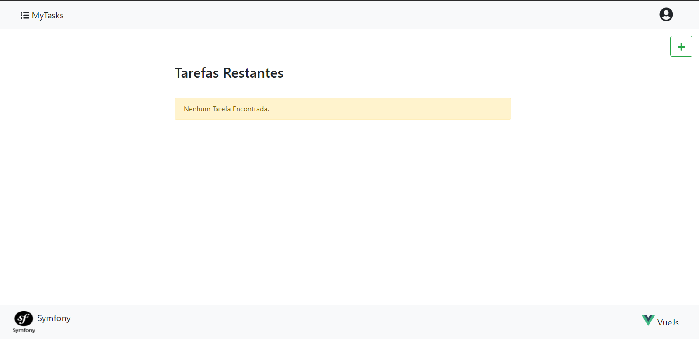
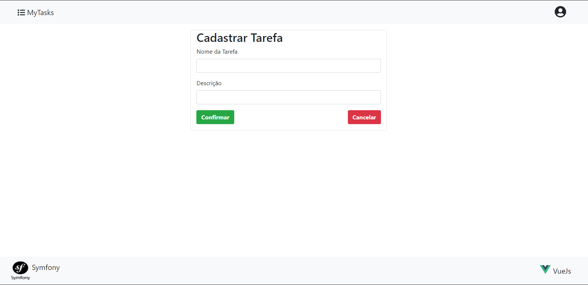
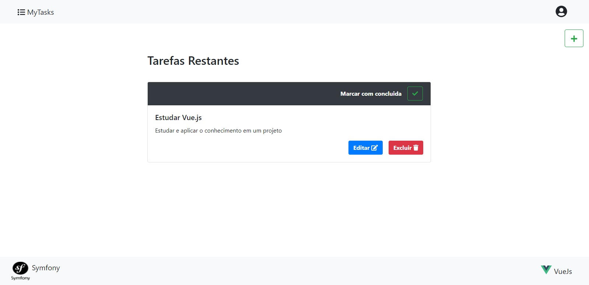
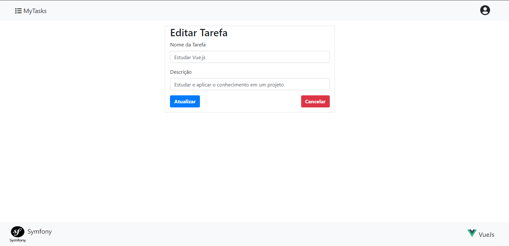
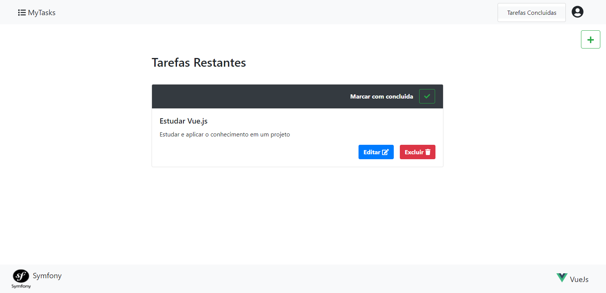
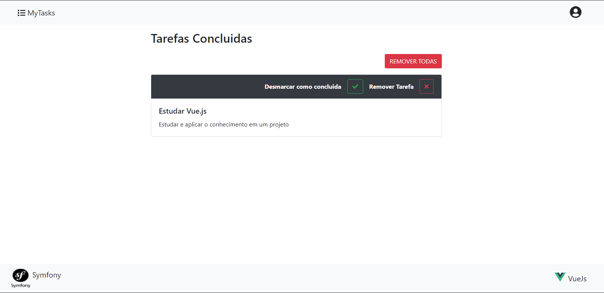
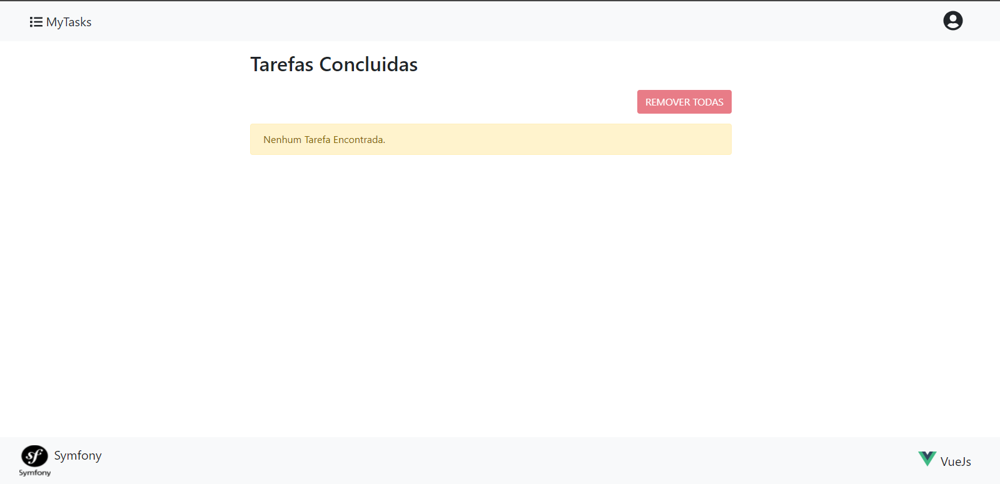

# List To-Do

<center>

<!--  -->


</center>

# Sobre o Projeto:

<!-- [Demo do Projeto](https://link.para.demo.caso.houver) -->

<!-- Descrição do **projeto**. Geralmente respondendo as perguntas: -->

1 - Qual o motivo, problema, solução ou curso inspirou a criação do projeto?

- O motivo pela criação do projeto foi o desejo de aprender novas ferramentas sendo elas Symfony(Framework PHP) e Vue.js.

2 - Qual ou quais são as principais funções do projeto

- O projeto conta com as funcionalidades comuns de um App de lista de Tarefas, sendo ela:

   - Cadastrar uma Tarefa.

   - Visualizar a lista de Tarefas.

   - Excluir uma ou mais Tarefas.

   - Atualizar um Tarefa.

   - Marcar ou desmarcar como concluído uma Tarefa.

#
## Layout Web

<br/>

<!-- Para deixar as imagens uma embaixo da outra, devesse colocar os links um embaixo outro com  duas quebras de linha -->

<!-- 

 -->



# 



#



#



#



#



<br/>

# Tecnologias utilizadas:

## Back end

- PHP (Symfony)

## Front end

- HTML / CSS / JS 
- Bootstrap
- Vue.js

## Banco de Dados

- MySQL

# Por onde começar:

Clone ou baixe o projeto dentro do repositório de seu desejo, apos isso você vai precisar executar o projeto em partes:
## Back end

Pré-requisitos: PHP 7.4+ e Symfony

```bash

# entrar na pasta do projeto back end
cd seu_repositorio/serve

# executar o projeto
symfony serve

# ou
Symfony serve -d 

# o segundo modo de execução deixo o back end executando em segundo plano
# deixando o seu terminal livre para uso 
```

## Front end web

Pré-requisitos: Node, npm ou yarn

```bash
# entrar na pasta do projeto front end web
cd seu_repositorio/web

# instalar dependências
yarn install
# ou
npm i

# executar o projeto
yarn run serve
# ou
npm serve
```

# Autor(es)

**Nome do Autor**

https://www.linkedin.com/in/autor
github.com/autor/

**Nome do Autor2**

https://www.linkedin.com/in/autor2
github.com/autor2/